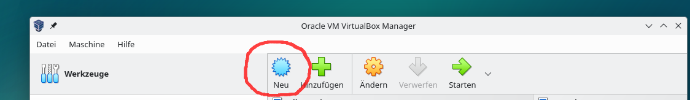
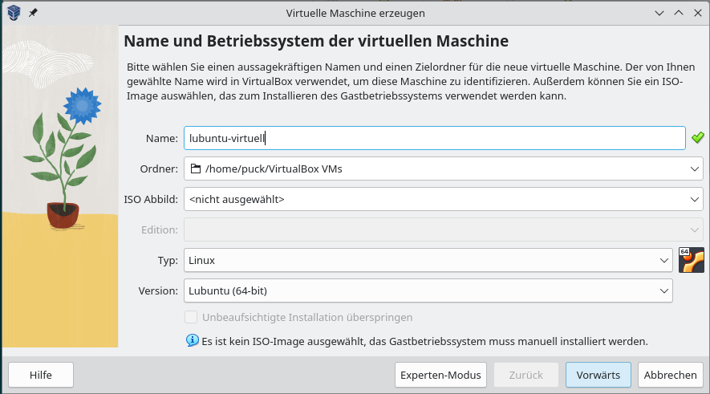
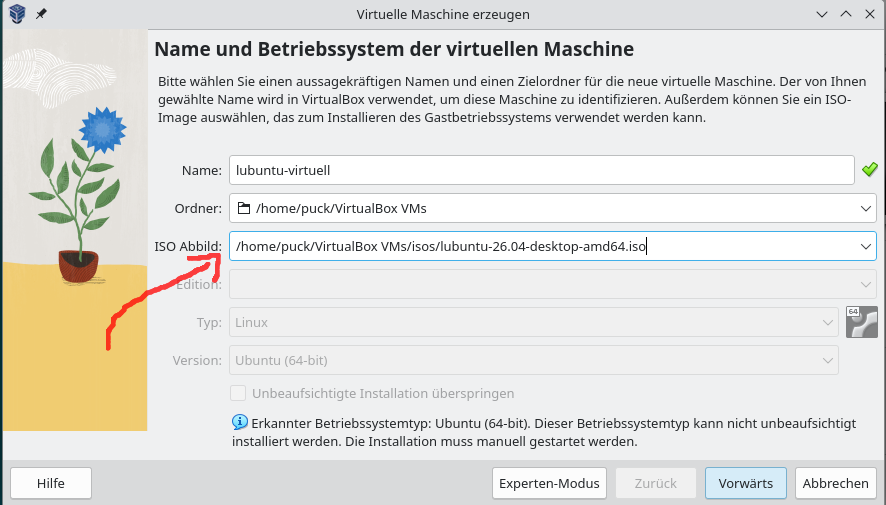
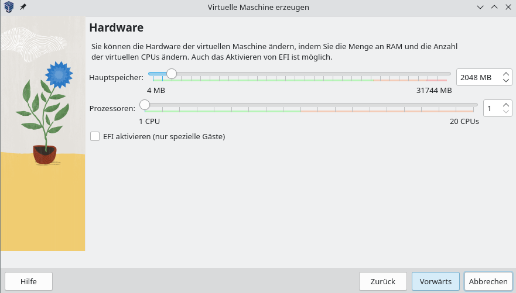
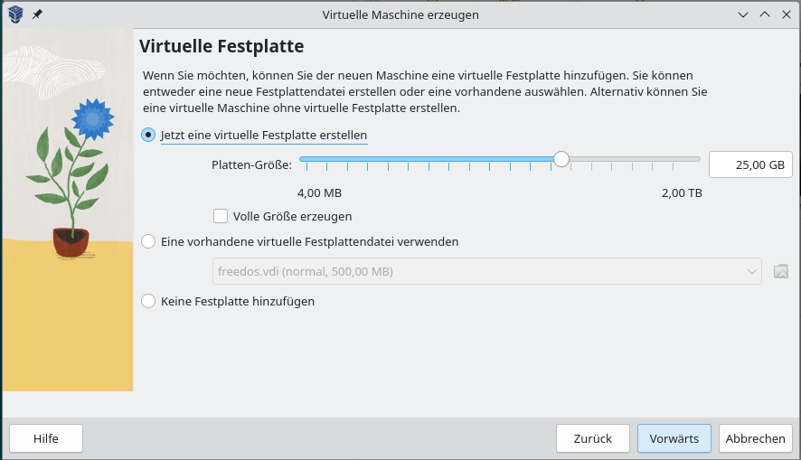
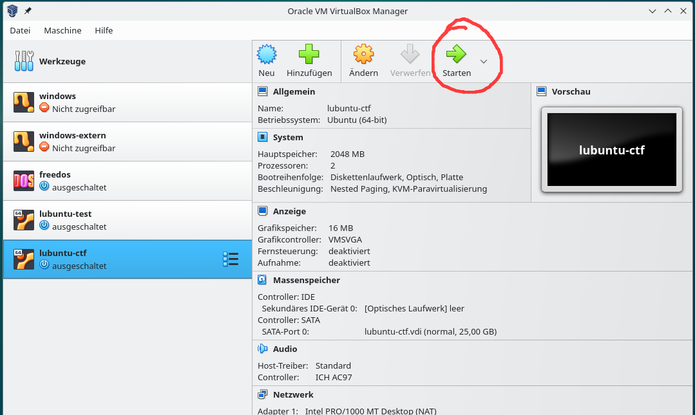

# Einrichtung Virtual Box

## Links für die Installation

## Wiederholung

- Was ist ein Betriebssystem, warum brauche ich das eigentlich??
    - Programm, um das System zu betreiben
    - verwaltet die Hardware und Software
    - startet Programme
    - stellt Oberfläche für Benutzer bereit
- Virtualisierung -> Was ist der Host, was ist der Gast (Guest), Hypervisor?
    - Host -> Der Computer auf dem die virtualle Maschine installiert wird
    - Gast -> virtuelle Maschine ( zum Beispiel ein Linux auf einem Windows Rechner)
    - Hypervisor -> Programm, dass die virtuellen Maschinen organisiert

## Installation für Windows

### Herunterladen der Dateien:
- [Virtual Box](https://download.virtualbox.org/virtualbox/7.2.16/VirtualBox-7.2.16-174877-Win.exe)
- [Microsoft Visual C++ Redistributable](https://aka.ms/vc14/vc_redist.x64.exe) - wird benötigt damit Virtual Box laufen kann (zuerst installieren)
- [Lubuntu eine einfache Linux Distribution](https://cdimage.ubuntu.com/lubuntu/releases/26.04/release/lubuntu-26.04-desktop-amd64.iso)

### Installation der Programme
1. Microsoft Visual C++ Redistributable installieren, dies wird benötigt, damit Virtual Box unter Windows laufen kann
2. Virtual Box installieren, bei der Installation brauchen keine Einstellungen verändert zu werden

### Virtuelle Maschine erstellen
1. neue virtuelle Maschine anlegen

2. im Dialog der Maschine einen Namen geben

3. die Installationsdatei für das Betriebssystem unter ISO Abbild auswählen

4. die Hardware der Maschine einstellen (2-4GB RAM, 1-2 Prozessoren, 25GB Festplatte)

5. Auf Fertigstellen klicken

6. die virtuelle Maschine starten und die Installation durchlaufen

## Zusammenfassung
- wir nutzen Virtual Box, um virtuelle Maschinen zu erstellen und diese zu verwalten (starten, stoppen, Einstellungen ändern)
- Virtual Box ist der Hypervisor (Typ 2), es arbeitet in unserem Windows (Host System)
- wir können unterschiedliche Betriebssysteme installieren (in dem Beispiel Lubuntu)

## Ausblick
- ihr könnt verschiedene Betriebssysteme ausprobieren, 2 Möglichkeiten für den Nachmittag:
- [FreeDos](https://www.freedos.org) 
    - ein gannz kleines Betriebssystem, nutzbares DOS Betriebssystem, mit einigen alten Spielen (Doom :-) )
    - hier ist die ISO-Datei zum [download](https://download.freedos.org/1.4/FD14-LiveCD.zip), in der zip-Datei befindet sich die ISO-Datei, die ihr in Virtual Box nutzen könnt
    - die Maschine braucht nur 64MB Ram und 1 Prozessor, als Festplatte reichen 500MB

- ihr schaut euch ["Hack the Box"](https://www.hackthebox.com/get-started) an, dort nutzt ihr ein spezielles auf Security ausgerichtetes Linux (Parrot OS)
    - "Hack the Box" ist eine bekannter Anbieter für Sicherheitskurse (Hacking Grundlagen)
    - ihr könnt dort die Startkurse kostenlos nutzen und lernt etwas zu speziellen Linux "Sicherheits"-Programme
    - nutzt diese Programme nur für die Aufgaben in Hack the Box und nicht bei echten Webseiten
    - ihr könnt Parrot OS in Virtual Box [installieren](https://parrotsec.org/docs/virtualization/install-parrot-on-virtualbox/) und dann für die Aufgaben in HTB nutzen