# Einrichten eines Debian-Servers

In dieser Zusatzaufgabe sollt ihr eine weitere virtuelle Maschine erstellen: einen einfachen Debian-Server. Debian ist sehr weit verbreitet.

## Vorbereitung

- Download des ISO-Images von [hier](https://cdimage.debian.org/debian-cd/current/amd64/iso-cd/debian-13.6.0-amd64-netinst.iso)
- Anlegen einer neuen virtuellen Maschine mit 2 GB RAM und 2 Prozessoren
- Ihr verwendet das heruntergeladene ISO-Image als Installationsmedium.

## Installation des Betriebssystems

- Nachfolgend findet ihr eine Schritt-für-Schritt-Anleitung durch den Installationsprozess.
- Nachdem ihr die virtuelle Maschine gestartet habt, werdet ihr vom Installer begrüßt.

### 1. Installer starten

- Wählt im ersten Menü `Graphical install` aus.
- Der grafische Installer wird nur für die Installation verwendet. Das fertige System bekommt später keine grafische Oberfläche.

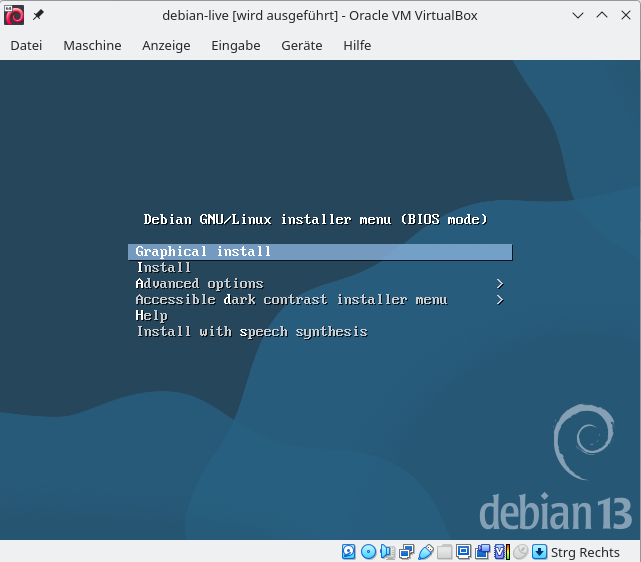

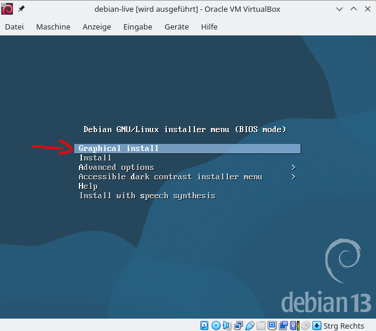

### 2. Sprache und Tastatur einstellen

- Sprache: `Deutsch`
- Standort: `Deutschland`
- Tastaturbelegung: `Deutsch`

Der Installer lädt anschließend einige Bestandteile. Das kann einen Moment dauern.

### 3. Netzwerk einrichten

- Als Rechnername könnt ihr `debian` verwenden.
- Den Domain-Namen lasst ihr leer.

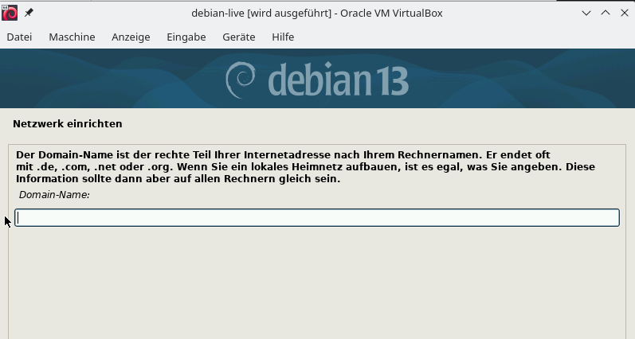

### 4. Benutzer einrichten

- Lasst beide Felder für das Root-Passwort leer.
- Dadurch wird der Root-Zugang per Passwort gesperrt.
- Euer normaler Benutzer kann später mit `sudo` administrative Aufgaben ausführen.

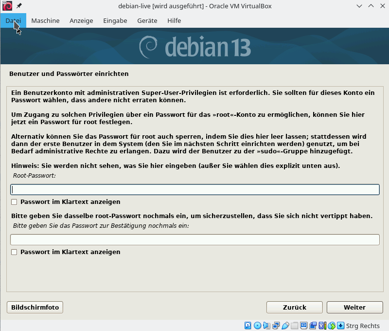

- Gebt euren vollständigen Namen ein.
- Danach legt ihr einen Benutzernamen fest.
- Vergebt ein Passwort und bestätigt es im nächsten Feld.

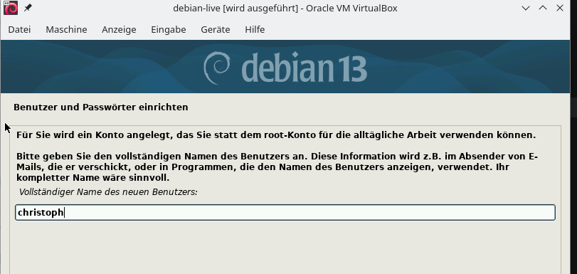

### 5. Festplatte partitionieren

- Wählt `Geführt - gesamte Platte verwenden`.

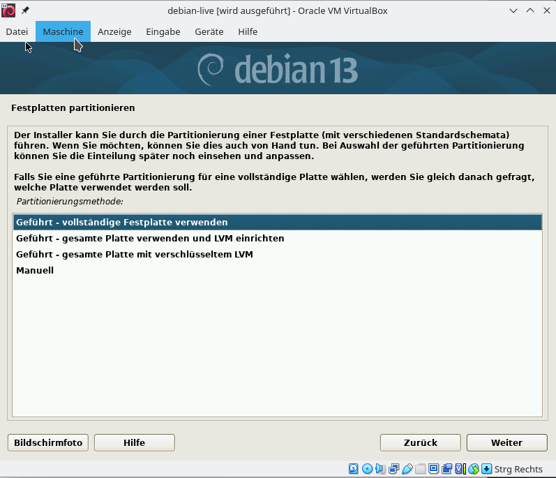

- Wählt die virtuelle Festplatte aus. In unserem Beispiel ist das die `VBOX HARDDISK`.
- Wählt anschließend `Alle Dateien auf eine Partition`.

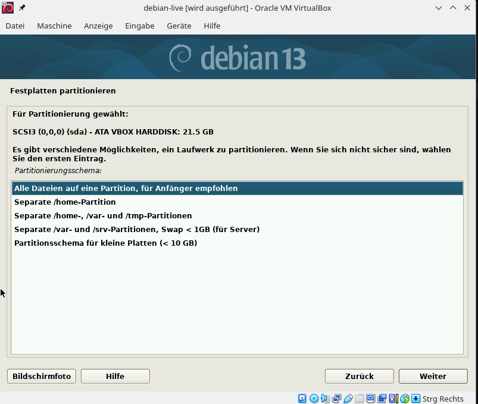

- Wählt `Partitionierung beenden und Änderungen übernehmen`.

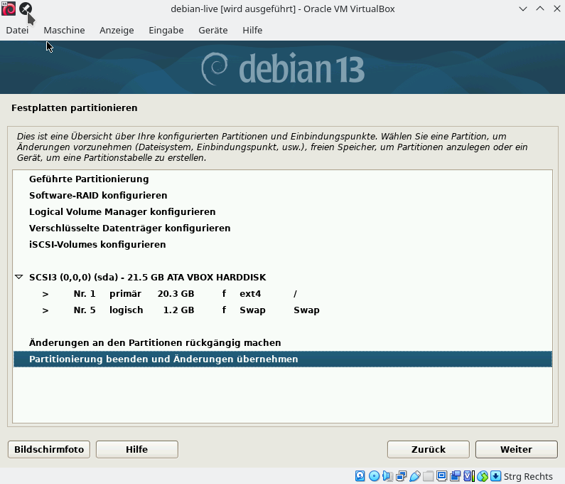

- Bestätigt das Schreiben der Änderungen mit `Ja`.

> Achtung: Dabei wird die virtuelle Festplatte der neuen VM gelöscht und neu eingerichtet.

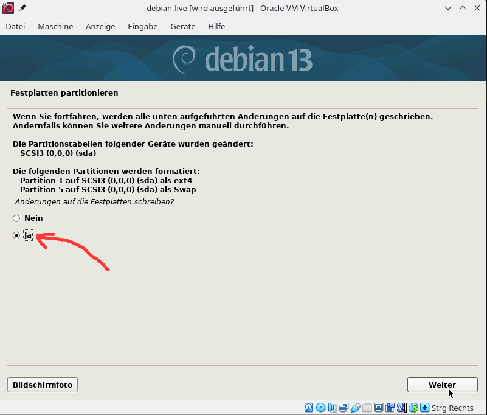

Die Installation des Grundsystems beginnt. Das kann einige Minuten dauern.

### 6. Paketmanager einrichten

- Wählt bei der Frage nach einem weiteren Installationsmedium `Nein`.

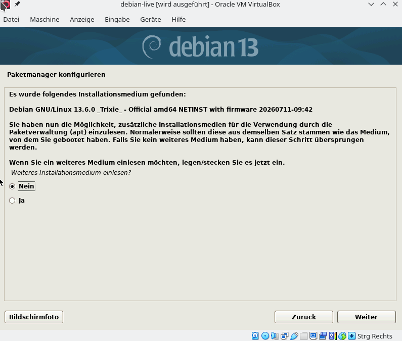

- Wählt als Land des Spiegelservers `Deutschland`.

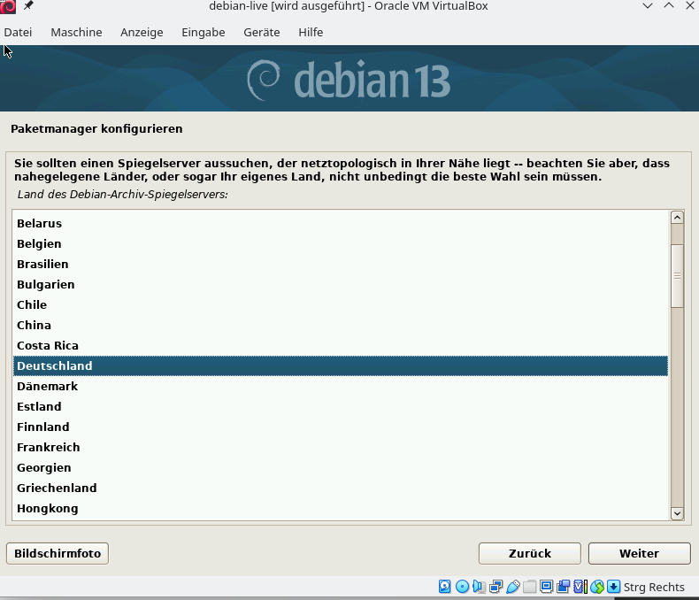

- Wählt als Spiegelserver `deb.debian.org`.

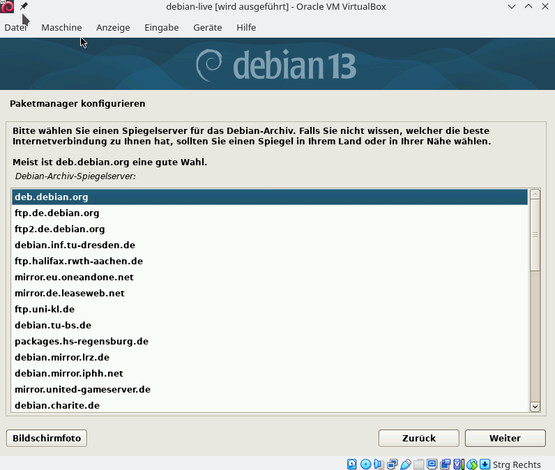

- Falls ihr keinen HTTP-Proxy verwendet, lasst das Feld leer.

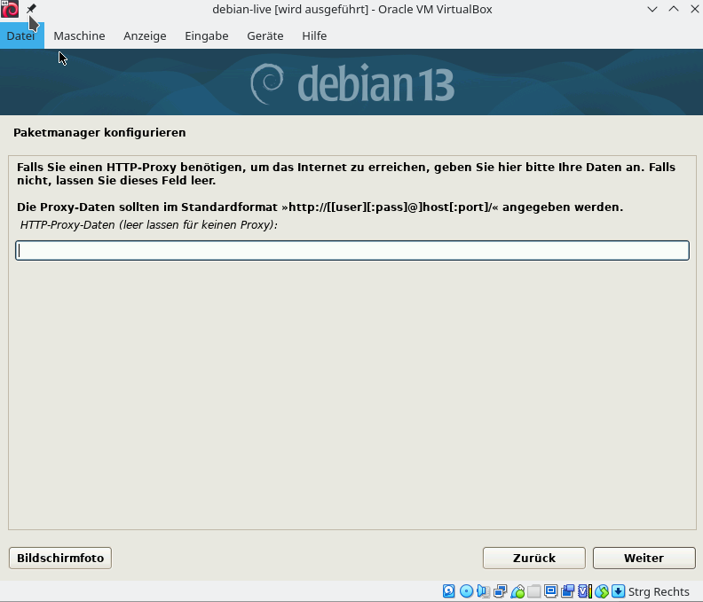

- Die Teilnahme an der Paketverwendungserfassung könnt ihr mit `Nein` ablehnen.

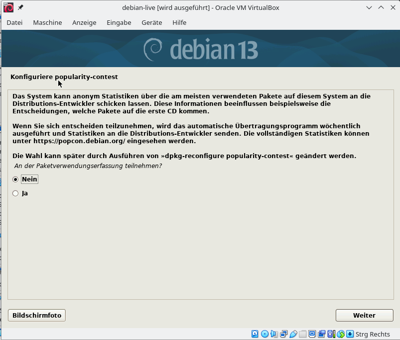

### 7. Software auswählen

Dieser Schritt ist wichtig, damit ein Server **ohne grafische Oberfläche** installiert wird.

- Mit der Leertaste könnt ihr eine Auswahl setzen oder entfernen.
- Wählt `Debian desktop environment` und alle Desktop-Umgebungen ab.
- Wählt `SSH server` aus.
- `Standard-Systemwerkzeuge` bleibt ausgewählt.
- Alle anderen Einträge bleiben abgewählt.

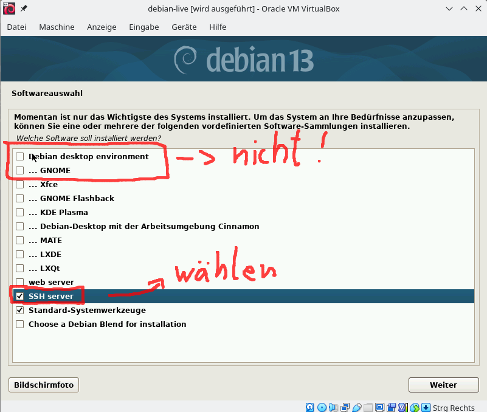

Die Auswahl sollte am Ende so aussehen:

```text
[ ] Debian desktop environment
[x] SSH server
[x] Standard-Systemwerkzeuge
```

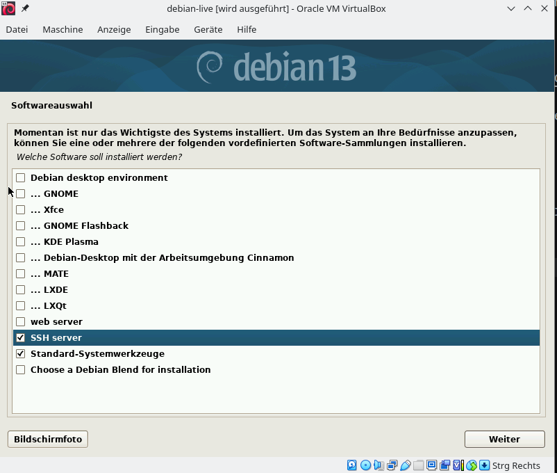

Bestätigt die Auswahl mit `Weiter`. Die ausgewählten Pakete werden nun installiert.

### 8. GRUB-Bootloader installieren

- Wählt bei der Installation des GRUB-Bootloaders `Ja`.

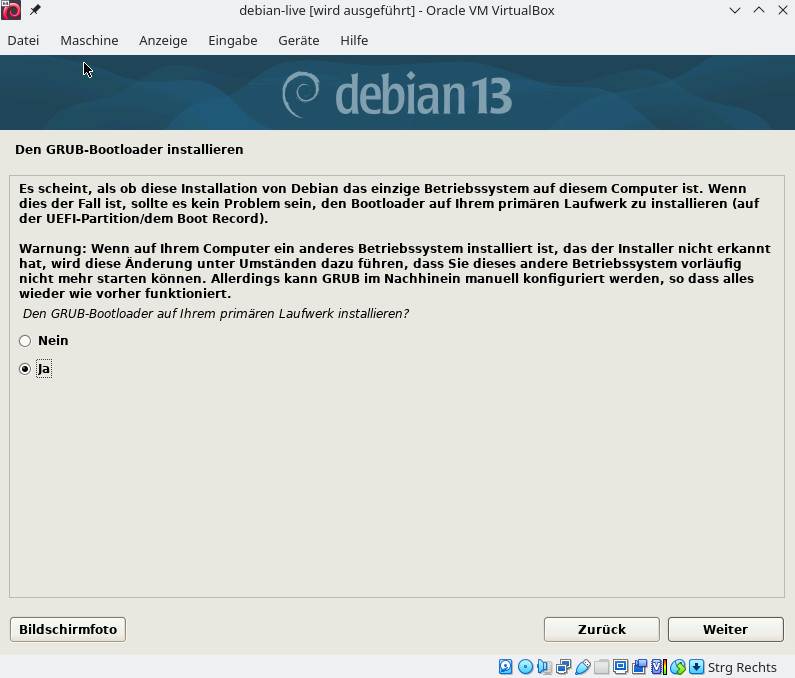

- Wählt als Ziel die virtuelle Festplatte `/dev/sda`.

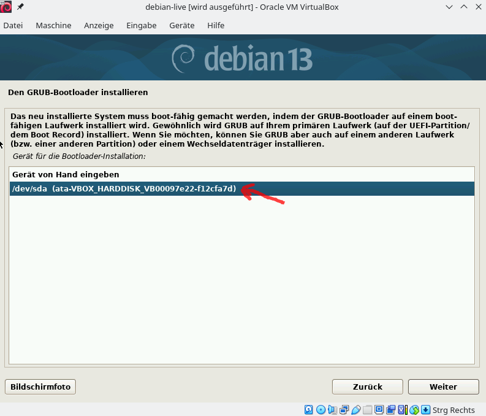

### 9. Installation abschließen

- Schließt die Installation ab und startet die VM neu.
- Falls erneut das Installationsmenü erscheint, entfernt das ISO-Image aus dem virtuellen Laufwerk und startet die VM noch einmal.
- Nach dem Start erscheint die Login-Aufforderung.

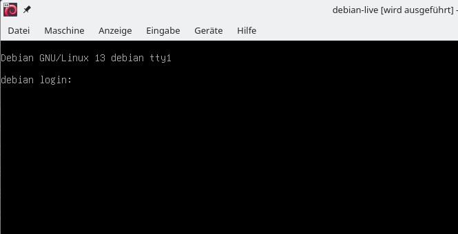

- Gebt euren Benutzernamen ein und drückt `Enter`.
- Gebt anschließend euer Passwort ein. Während der Eingabe werden keine Zeichen angezeigt.

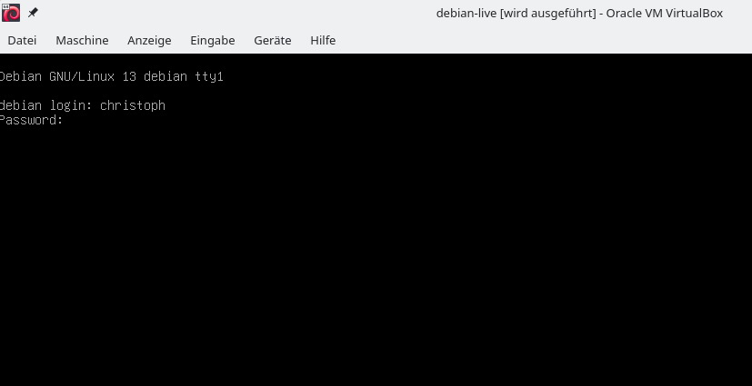

Wenn ihr die Kommandozeile mit eurem Benutzernamen seht, war die Anmeldung erfolgreich und euer Debian-Server ist einsatzbereit.

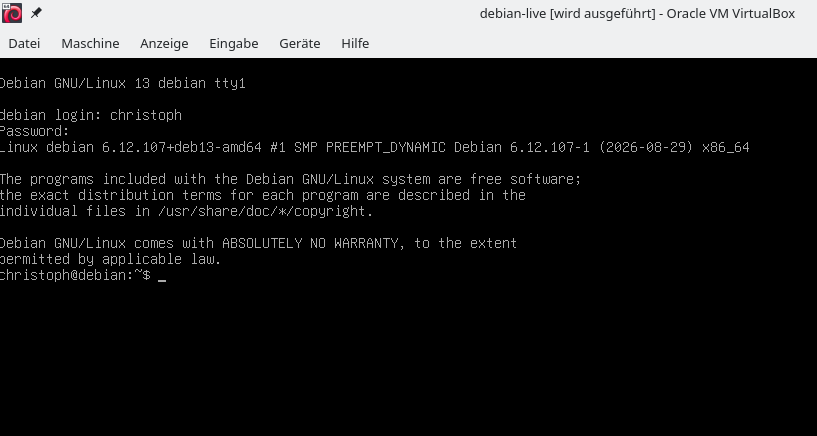
