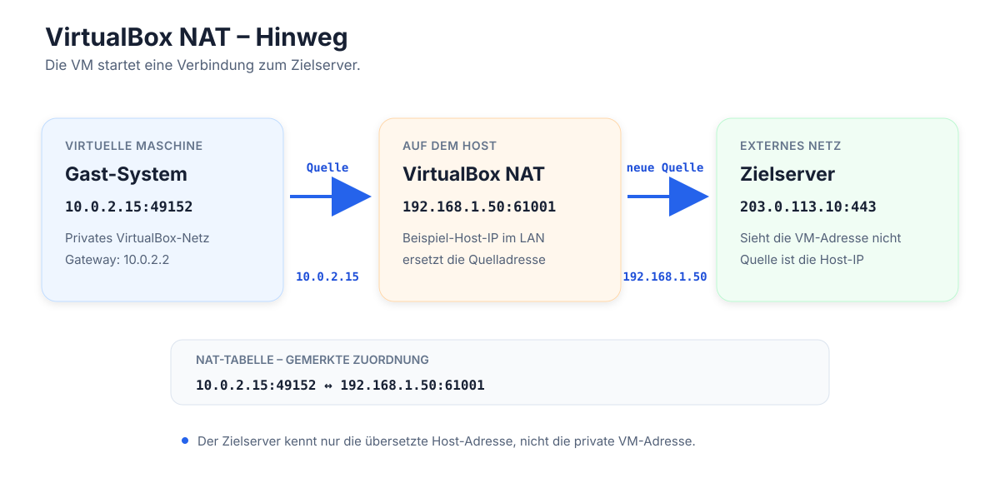
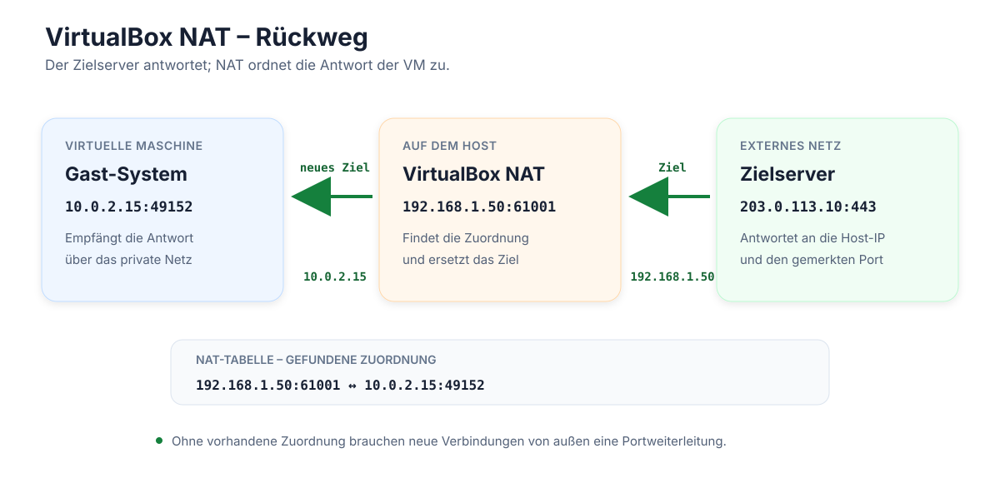

# Themen heute: Snapshots und Netzwerke

## Wiederholung

- Wofür werden virtuelle Maschinen genutzt?
    - losgelöst vom eigenen System
    - mehrere Betriebssysteme gleichzeitig nutzen
    - Test- und Entwicklungsumgebung: sicher ausprobieren und bei Problemen zurückgehen
    - Systeme und Dienste bewusst voneinander trennen
    - Hardware simulieren
    - Hardware einsparen (ein Server statt mehrerer Rechner)
    - alte Software laufen lassen

## Snapshots

- Ein Snapshot ist ein Abbild des aktuellen Zustands einer VM.
- Wir können Änderungen ausprobieren und bei Problemen zu diesem Zustand zurückspringen.
- Sinnvoll zum Beispiel vor Updates oder Änderungen an der Konfiguration.
- Wichtig: Ein Snapshot ist keine Datensicherung und ersetzt kein Backup.

## Backup

- Was ist ein Backup?
    - eine Kopie an einem anderen Ort
    - kann bei Verlust oder Beschädigung wiederhergestellt werden
    - braucht eine Strategie – auch für die Wiederherstellung
    - 3-2-1-Strategie
        - 3 Kopien
        - auf 2 unterschiedlichen Medien
        - 1 Kopie extern, zum Beispiel in der Cloud

### Wie kann ich eine virtuelle Maschine sichern?

#### Möglichkeit 1: Gesamten VM-Ordner sichern

- VM sauber herunterfahren.

```text
Nicht "Zustand speichern"
sondern vollständig herunterfahren.
```

- Dann gesamten VM-Ordner kopieren.
- Die Kopie an einem anderen Speicherort ablegen.
- Beispiel:

```text
VirtualBox VMs/
└── Debian/
    ├── Debian.vbox
    ├── Debian.vdi
    └── Snapshots/
```

#### Möglichkeit 2: Exportfunktion / OVA

- VirtualBox kann eine VM exportieren.
- Menü ungefähr:

```text
Datei
→ Appliance exportieren
```

- Das Ergebnis ist zum Beispiel eine einzelne Datei:

```text
Debian.ova
```

- Eine OVA ist ein transportierbares Paket der virtuellen Maschine.
- Gut geeignet für:
    - Übertragung auf einen anderen Rechner
    - Import in eine andere VirtualBox-Installation

### Kurz zusammengefasst

- Snapshot: zu einem früheren Zustand zurückspringen
- VM-Ordner sichern: Dateien der VM als Backup kopieren
- Export: VM als transportierbares Paket weitergeben oder aufbewahren

## Exkurs

- Was ist ein Server?
    - ein Computer, der Dienste oder Ressourcen anbietet
    - andere Computer können sich mit diesen Diensten verbinden
    - erreichbar über ein Netzwerk
    - kann man mieten
    - beantwortet Anfragen

## Was wir brauchen für einen Server

- ein Netzwerk
- einen Rechner

## Wie kommunizieren Rechner in Netzwerken?

- Beispiel: Rechner A möchte mit Rechner B kommunizieren.

```text
Rechner A  ←──────── Netzwerk ────────→  Rechner B
192.168.1.10                         192.168.1.20
```

- Beide Rechner brauchen eine Verbindung zum Netzwerk.
- Jeder Rechner braucht dort eine eigene IP-Adresse.
- Die IP-Adresse ist die Adresse eines Rechners im Netzwerk.
- Innerhalb desselben Netzwerks darf eine IP-Adresse nicht doppelt vergeben sein.
- Private IP-Adressen sind nur innerhalb des jeweiligen Netzwerks gültig.
    - Deshalb kann dieselbe private IP-Adresse in verschiedenen Netzwerken vorkommen.
- Rechner im gleichen Netzwerk können direkt miteinander kommunizieren.
- Zwischen unterschiedlichen Netzwerken vermittelt ein Router.

## Netzwerkmodi in VirtualBox

### NAT

- Die VM befindet sich in einem eigenen virtuellen Netzwerk von VirtualBox.
- Sie erhält dort eine eigene IP-Adresse.
- Verbindungen nach außen laufen über den Host-Rechner.
- Die VM kann normalerweise auf das Internet zugreifen.
- Andere Rechner im physischen Netzwerk sehen die VM normalerweise nicht direkt.





### Bridged / Netzwerkbrücke

- Die VM wird wie ein eigener Rechner mit dem physischen Netzwerk verbunden.
- Sie erhält eine eigene IP-Adresse aus demselben Netzwerk wie der Host.
- Andere Rechner im Netzwerk können die VM direkt erreichen.
- Das ist zum Beispiel praktisch, wenn die VM einen Server bereitstellen soll.
- Die VM ist dadurch im Netzwerk sichtbarer als bei NAT.

```text
Host ─┐
      ├── physisches Netzwerk / Router
VM ───┘
```

### Merksatz

- NAT: Die VM befindet sich hinter dem Host in einem eigenen Netzwerk.
- Bridged: Die VM ist ein eigener Rechner im gleichen Netzwerk wie der Host.
