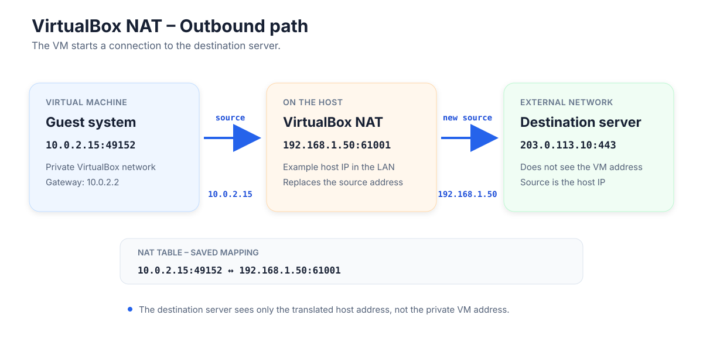
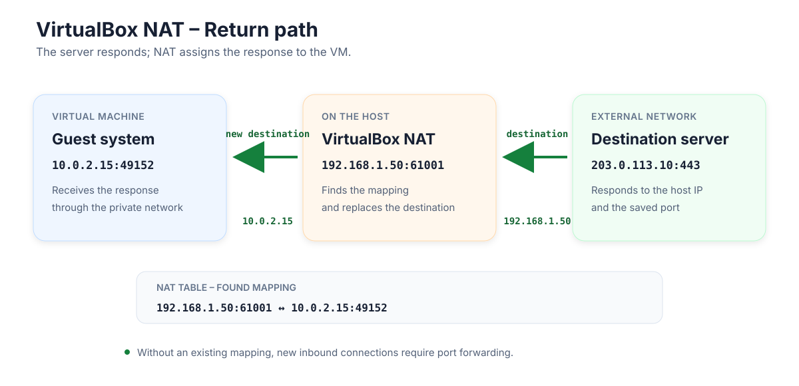

# Today's Topics: Snapshots and Networks

## Review

- What are virtual machines used for?
    - working independently from the host system
    - using several operating systems at the same time
    - test and development environments: trying things safely and going back if problems occur
    - separating systems and services from each other
    - simulating hardware
    - saving hardware (one server instead of several computers)
    - running old software

## Snapshots

- A snapshot is an image of the current state of a VM.
- We can try changes and return to this state if problems occur.
- It is useful, for example, before updates or configuration changes.
- Important: A snapshot is not a data backup and does not replace one.

## Backup

- What is a backup?
    - a copy stored in another location
    - can be restored if data is lost or damaged
    - needs a strategy – including a strategy for restoring it
    - the 3-2-1 backup strategy
        - 3 copies
        - on 2 different types of storage media
        - 1 external copy, for example in the cloud

### How can I back up a virtual machine?

#### Option 1: Back up the complete VM folder

- Shut down the VM properly.

```text
Do not use "Save State".
Shut down the VM completely.
```

- Then copy the complete VM folder.
- Store the copy in another location.
- Example:

```text
VirtualBox VMs/
└── Debian/
    ├── Debian.vbox
    ├── Debian.vdi
    └── Snapshots/
```

#### Option 2: Export function / OVA

- VirtualBox can export a VM.
- The menu is approximately:

```text
File
→ Export Appliance
```

- The result can be a single file, for example:

```text
Debian.ova
```

- An OVA is a transportable package of the virtual machine.
- It is useful for:
    - transferring the VM to another computer
    - importing it into another VirtualBox installation

### In short

- Snapshot: return to an earlier state
- Back up the VM folder: copy the VM files as a backup
- Export: share or store the VM as a transportable package

## Digression

- What is a server?
    - a computer that provides services or resources
    - other computers can connect to these services
    - can be reached over a network
    - can be rented
    - responds to requests

## What we need for a server

- a network
- a computer

## How do computers communicate in networks?

- Example: Computer A wants to communicate with Computer B.

```text
Computer A  ←──────── Network ────────→  Computer B
192.168.1.10                          192.168.1.20
```

- Both computers need a connection to the network.
- Each computer needs its own IP address in that network.
- The IP address is the address of a computer in the network.
- An IP address must not be assigned twice within the same network.
- Private IP addresses are only valid within their respective network.
    - Therefore, the same private IP address can appear in different networks.
- Computers in the same network can communicate directly with each other.
- A router connects different networks.

## Network modes in VirtualBox

### NAT

- The VM is located in its own virtual VirtualBox network.
- It receives its own IP address in that network.
- Outgoing connections pass through the host computer.
- The VM can normally access the internet.
- Other computers in the physical network normally cannot see the VM directly.




### Bridged / Network Bridge

- The VM is connected to the physical network like a separate computer.
- It receives its own IP address from the same network as the host.
- Other computers in the network can reach the VM directly.
- This is useful, for example, if the VM should provide a server.
- The VM is more visible in the network than it is with NAT.

```text
Host ─┐
      ├── physical network / router
VM ───┘
```

### Remember

- NAT: The VM is behind the host in its own network.
- Bridged: The VM is a separate computer in the same network as the host.
