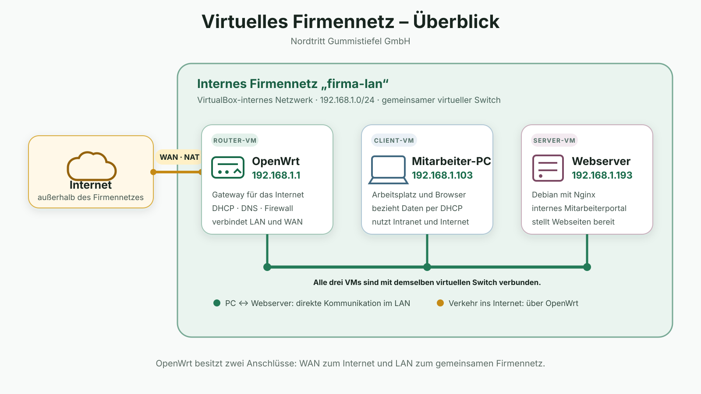

# Linux

## Recap Virtual Box

### Szenario Firmennetzwerk

> Die Nordtritt Gummistiefel GmbH besitzt ein internes Mitarbeiterportal. Der Mitarbeiter-PC erhält seine Netzwerkkonfiguration automatisch. Der Debian-Webserver stellt das Portal bereit und OpenWrt verbindet das Firmennetz mit dem Internet.

## Linux
- Linux ist ein Betriebssystem (OS)
- Es wurde entwickelt, um ein System namens Unix zu ersetzen
- Auch Mac OS hat seine Wurzeln in Unix
- Linux selbst ist eigentlich der Kern oder `kernel` deines Betriebssystems
    - Der Kernel von Mac OS heißt XNU
    - Der Kernel von Windows heißt NT
- Es gibt verschiedene Arten von Linux: Linux-Distributionen oder `distros`
- Eine Distro kombiniert den Kernel mit einer Reihe cooler Software
    - Ein Browser
    - Büroprogramme
    - Die Desktop-Umgebung (Visuals)
    - Software-Paketmanager
    - Und so weiter...
- Die Distro, die wir heute verwenden: `Lubuntu`
- `Lubuntu` basiert auf `Ubuntu` und das basiert einer anderen Distro namens `Debian`
- Linux ist anpassbar, schnell, kostenlos und Open Source
    - https://github.com/torvalds/linux

### Benutzung
- unser Lubuntu hat eine grafische Oberfläche, ihr könnt es wie bei Windows auch mit der Maus bedienen
- aber Linux Terminal zu beherrschen ist ein guter Skill:
    - wird auf Servern benötigt
    - ihr könnt Aufgaben automatisieren
    - ihr seid schneller
    - es sieht cool aus ;-) 

**Erste Terminal Befehle**
- `pwd` - zeigt das aktuelle Arbeitsverzeichnis an
- `ls` - zeigt den Inhalt des aktuellen Ordners an
- `mkdir test` - erstellt einen Ordner mit dem Namen `test` 
- `cd` - wechselt den Ordner
    - `cd Dokumente` - wechselt in den Unterordner Dokumente
    - `cd ..` - geht einen Ordner nach oben
    - `cd /` - wechselt zum root Verzeichnis
    - `cd ~` - wechselt in den Benutzerordner 
- `touch quatsch.txt` - erstellt eine Datei mit dem Namen `quatsch.txt`
- `nano quatsch.txt` - öffnet einen eingebauten Texteditor im Termina (nano)
    - zum Speichern und beenden von nano -> `STRG` + `x`, danach j oder y und `enter`
- `cat quatsch.txt`- zeigt den Inhalt der Datei quatsch.txt im Terminal an

### Ausblick - Installation von Programmen
- heute nur kurz die Befehle, was diese konkret bedeuten schauen wir uns morgen an
- `sudo apt update` - aktualisiert die Paketliste
- `sudo apt install falkon` - installiert ein Programm (Falkon - Webbrowser)
- `sudo` - gibt euch mehr Rechte, damit könnt ihr Veränderungen am System vornehmen, daher braucht ihr das Passwort

