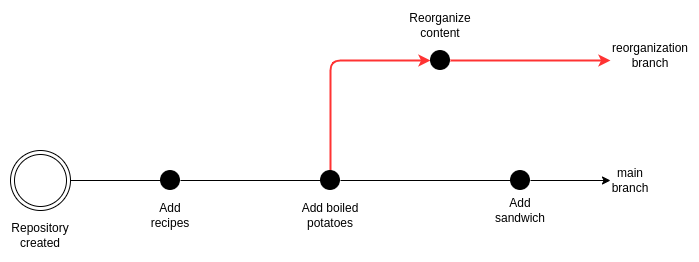
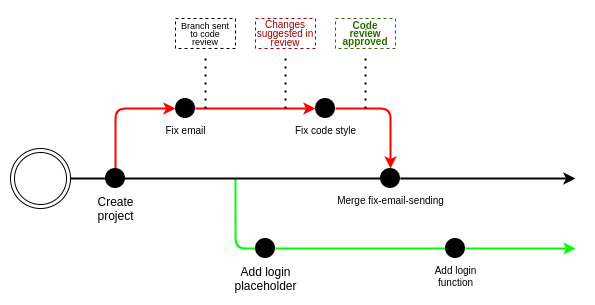

# Zusammenarbeit

## Branch
- Wir haben bisher auf dem "master"-Branch gearbeitet
    - Verschiedene Git-Versionen verwenden unterschiedliche Standardnamen
    - Main ist der neue empfohlene Name
    - Du kannst dies auch in deinen Git-Einstellungen konfigurieren
    - Du kannst Branches umbenennen
- Ein Branch wird normalerweise so dargestellt
    - 
    - Hier haben wir einen Branch, der vom Hauptbranch ausgeht
    - Branches haben ihre eigenen Historien
        - Die Reorganisation hat drei Commits
        - Der Hauptbranch hat drei Commits
        - Zwei davon sind geteilt
    - Ein Branch kann so viele Commits haben, wie du möchtest

- Die Antwort auf "Wofür verwenden wir Branches?" wird als `branching strategy` bezeichnet
    - Es gibt viele davon
    - Verschiedene Unternehmen können unterschiedliche Strategien haben
    - Verschiedene Projekte können unterschiedliche Strategien haben

- Eine sehr beliebte Strategie wird `feature branches` genannt
    - Kann mit der oben genannten Strategie kombiniert werden
    - Wenn du anfängst, an irgendetwas in deinem Projekt zu arbeiten
    - Erstellst du zuerst einen Branch vom Hauptbranch
    - Ein Branch könnte "fix-email-sending" sein
        - Du kannst mehrere Commits im Branch machen
        - Sobald du fertig bist, wird der Branch zurück in den Hauptbranch gemerged
        - Dann wird der "fix-email-sending" Branch gelöscht
    - Dies ermöglicht es dir, gleichzeitig leicht an mehreren Features zu arbeiten
    - Ein Senior könnte sich Zeit nehmen, um "fix-email-sending" zu überprüfen
    - Während du wartest, kannst du an "add-login" arbeiten
    - Wenn "fix-email-sending" genehmigt wird
    - Merge es in den Hauptbranch, lösche den Branch
    - Und fahre fort mit der Arbeit an "add-login"
    - 

## GitHub-Zusammenarbeit

- `git switch -c <name-of-branch>`
    - Es gibt verschiedene Wege, einen Branch zu erstellen
    - Das empfehlen wir
    - HINWEIS
        - Achte darauf, auf welchem Branch du gerade bist
        - Der neue Branch wird vom aktuellen Branch erstellt

- `git switch <branch>`
    - Es gibt verschiedene Wege, zu wechseln, auf welchem Branch du bist
    - Das empfehlen wir

- `git branch -a`
    - Listet alle Branches auf

- `git branch -m <name>`
    - Benennt den aktuellen Branch um

- `git push origin <name>`
    - schiebt deinen aktuellen Branch zu einem remote Repo (github)

## Beispiel Ablauf

Du arbeitest in einer Gruppe an einem Projekt:

1. Du gehst zu dem Repo auf GitHub und klonst dir das Projekt `git clone <address>`
2. Lokal auf deinem Rechner erzeugst du einen neuen Branch
3. Du arbeitest auf deinem Branch 
4. Du überprüfst ob alle deine Änderungen Committet sind (`git status`)
5. Du pushst deine Änderungen zu zurück zu Github `git push origin <name>`
6. Auf GitHub erzeugst du einen Pull Request
    - ein PR ist eine Frage ob deine Änderungen übernommen werden können (in den main Branch)
7. Wenn es keine Konflikte gibt, wird auf Github ein Merge ausgeführt, jetzt sind deine Änderungen in der main
8. Du wechselst auf deinem Rechner zurück zu `main`
9. Du holst dir die aktuelle Version zurück auf deinen Rechner `git pull`
10. Wenn du nun eine neue Aufgabe hast, erstellst du wieder einen neuen Branch ausgehend von main. Dein alter Branch kann gelöscht werden

# Zusammenfassung

- Zusammenarbeit ist der Schlüssel
- Oft verwendest du Branches, um Teamarbeit zu organisieren
- Branches führen oft zu Pull-Anfragen
- Pull-Anfragen werden oft überprüft (Code-Überprüfung)