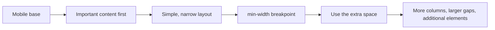

###### Topics

Responsive Web Design

- Understand the purpose of responsive design
- Learn the basic idea of mobile first
- Adapt content to different screen sizes with simple techniques

Layout with the Box Model and Flexbox

- Understand the box model with margin, border, padding, and content
- Build simple layouts with Flexbox
- Control the alignment and arrangement of elements with Flexbox

<br><br><br>
# 📱 Responsive Web Design

Responsive web design means that a website adapts to different screen sizes and device characteristics. The same page should look sensible and remain easy to use on a small smartphone, a tablet, a laptop, and a large monitor. The goal is not simply to make everything smaller or larger. Content, spacing, navigation, and layout should respond in a way that lets people read and use the page comfortably ([Responsive design](https://developer.mozilla.org/en-US/docs/Learn/CSS/CSS_layout/Responsive_Design)).

In the past, websites were often built for one fixed width, for example only for desktop screens. Today, this quickly causes problems: lines of text become too wide, buttons become too small, images overflow the screen, or menus are difficult to use on a phone. Responsive design addresses exactly this problem.

An important technical foundation is the *viewport*. To make sure that a mobile browser scales the page correctly, the HTML `<head>` normally contains this meta tag: ([Using the viewport meta tag](https://developer.mozilla.org/en-US/docs/Web/HTML/Viewport_meta_tag))

```html
<meta name="viewport" content="width=device-width, initial-scale=1.0">
```

Without this tag, a mobile browser may behave as if the page had been designed for a much wider desktop screen. As a result, everything appears tiny.


<br><br><br>
## 📖 Understanding the Purpose of Responsive Design

At its core, responsive means: **the layout is flexible instead of rigid.**

A responsive website typically adapts:

- the width of sections
- the arrangement of columns
- the size and scaling of images
- font sizes and spacing
- navigation
- the amount of content visible at the same time

Imagine a news website. On a large screen, it might show three columns next to each other: navigation on the left, the article in the middle, and additional information on the right. That would be impractical on a smartphone. There, the sections are often displayed one below the other: the most important content first, followed by the other sections. This is responsive thinking.

An important point is that **responsive does not automatically mean identical on every device**. Instead, it means *equally usable on every device*. The presentation may change as long as the experience remains useful.

This comparison shows the difference:

| Approach | Behaviour |
|---|---|
| Fixed website | Often has a rigid width, such as 1200px |
| Responsive design | Responds to the available width and adapts |
| Desktop-centred | Often becomes too small or confusing on a phone |
| User-centred | Rearranges content to suit the device size |

One central principle of responsive design is: **content takes priority over decoration**. First, the important parts must be readable and usable. Finer visual details come afterwards.

Some common techniques are:

- relative widths such as `%`
- flexible units such as `rem`, `vw`, or `clamp()`
- images with `max-width: 100%`
- media queries that change layouts at specific widths ([Using media queries](https://developer.mozilla.org/en-US/docs/Web/CSS/CSS_media_queries/Using_media_queries))

Here is a simple comparison between a non-responsive and a responsive image:

```css
/* unsuitable for small devices */
img {
  width: 900px;
}

/* much better */
img {
  max-width: 100%;
  height: auto;
}
```

In the second example, the image never becomes wider than its container, so it cannot overflow the screen.


<br><br><br>
## 📲 Learning the Basic Idea of Mobile First

**Mobile first** means that you design and code for small screens first and then extend the layout for larger screens. This approach is widely used because small displays provide the strictest constraints. If something is clear and usable there, it can usually be expanded successfully for larger devices ([Responsive design](https://developer.mozilla.org/en-US/docs/Learn/CSS/CSS_layout/Responsive_Design)).

The opposite approach would be to build a complex desktop version first and later try to squeeze everything onto a smartphone. That often leads to confusing CSS and a poor user experience.

With mobile first, you begin by asking:

- What is the most important content?
- What needs to be visible immediately?
- Which elements genuinely need space?
- What can be added or arranged differently on larger screens?

The technical implementation usually works like this:

1. Write the default rules for small screens.
2. Use `@media (min-width: ...)` to extend the layout when more space is available ([Using media queries](https://developer.mozilla.org/en-US/docs/Web/CSS/CSS_media_queries/Using_media_queries)).

A typical pattern looks like this:

```css
/* default: mobile */
.container {
  display: block;
}

/* from 768px: tablet/desktop */
@media (min-width: 768px) {
  .container {
    display: flex;
    gap: 2rem;
  }
}
```

The browser reads this as: “Start with a simple mobile layout. When there is enough space, use a more flexible arrangement.”

This is the basic logic of mobile first:



Why is mobile first useful from both a teaching and a technical perspective?

### It creates clear content priorities

There is no room for unnecessary elements on a small screen. Mobile first therefore forces you to decide what is truly important. This almost always improves the quality of the design.

### CSS often stays cleaner

When you begin with a small layout and add features later, you usually need fewer special rules that overwrite earlier styles. Your CSS becomes clearer and easier to maintain.

### Performance often benefits

People using mobile devices do not always have the fastest connection or device. A simple, lightweight starting point is therefore often the better choice. This is also an important idea in the web performance guidance from Google and web.dev ([Responsive web design basics](https://web.dev/responsive-web-design-basics/)).

### Mobile first does not mean “smartphones only”

This is a common misunderstanding. Mobile first does not mean that desktop is unimportant. It only means that you start with the smallest useful version and build upwards from there.


<br><br><br>
## 🧩 Adapting Content to Different Screen Sizes with Simple Techniques

You do not need a complicated framework to get started. Many adaptations can be achieved with a few basic CSS techniques.

### Fluid widths instead of rigid pixel values

If a container is always `1200px` wide, it will not fit on smaller devices. It is often better to combine `width: 100%` with `max-width`.

```css
.wrapper {
  width: 100%;
  max-width: 70rem;
  margin: 0 auto;
  padding: 1rem;
}
```

This means:

- The section may use all available width.
- It does not grow infinitely wide.
- `margin: 0 auto` centres it.

### Flexible images

```css
img {
  max-width: 100%;
  height: auto;
}
```

This lets images shrink with their container instead of overflowing. It is one of the simplest and most important responsive techniques.

### Think flexibly about spacing and font sizes

Rigid font sizes can look unbalanced on very small or very large screens. Using `rem` instead of `px` already makes many things more flexible because `rem` relates to the root font size ([Values and units](https://developer.mozilla.org/en-US/docs/Learn/CSS/Building_blocks/Values_and_units)).

A modern example is `clamp()`:

```css
h1 {
  font-size: clamp(1.8rem, 4vw, 3rem);
}
```

Roughly speaking, this means:

- no smaller than `1.8rem`
- no larger than `3rem`
- between those limits, the size may respond to the viewport

### Adapt layouts with media queries

If content should be stacked on small screens and placed side by side on larger screens, you can control it with a media query.

```css
.cards {
  display: flex;
  flex-direction: column;
  gap: 1rem;
}

@media (min-width: 48rem) {
  .cards {
    flex-direction: row;
  }
}
```

The cards are displayed one below the other on mobile devices and next to each other from `48rem` upwards.

### Simplify navigation

A horizontal menu with many items often works poorly on small screens. You could arrange its items vertically on narrow displays or use a more compact menu.

```css
nav ul {
  display: flex;
  flex-direction: column;
  gap: 0.5rem;
  list-style: none;
  padding: 0;
}

@media (min-width: 50rem) {
  nav ul {
    flex-direction: row;
  }
}
```

### Reorder content carefully

CSS can change the visual order of elements. However, the original HTML order remains important for screen readers and keyboard navigation. Important content should therefore already appear in a sensible order in the HTML, and CSS should only be used carefully for reordering ([order](https://developer.mozilla.org/en-US/docs/Web/CSS/order)).

### A complete, simple example

```html
<section class="layout">
  <article class="main">Main content</article>
  <aside class="sidebar">Sidebar</aside>
</section>
```

```css
.layout {
  display: flex;
  flex-direction: column;
  gap: 1rem;
}

.main,
.sidebar {
  padding: 1rem;
  border: 1px solid #ccc;
}

@media (min-width: 60rem) {
  .layout {
    flex-direction: row;
  }

  .main {
    flex: 2;
  }

  .sidebar {
    flex: 1;
  }
}
```

On small devices, the two sections are stacked. On larger screens, they become two columns. This is a common practical workflow: start small, then extend the layout.

One important thought to finish this section: **adapt to the content, not to device categories**. It is often better to add a breakpoint where the layout actually begins to break instead of rigidly targeting “smartphone”, “tablet”, and “desktop” ([Responsive web design basics](https://web.dev/responsive-web-design-basics/)).


<br><br><br>
# 📦 Layout with the Box Model and Flexbox

To design websites, you need to understand how the browser treats elements as boxes. Almost everything in an HTML layout is a rectangle. This basic principle is called the **box model**, and a great deal of CSS knowledge builds on it. When you want to arrange several of these boxes flexibly next to or below each other, **Flexbox** comes into play ([The box model](https://developer.mozilla.org/en-US/docs/Learn/CSS/Building_blocks/The_box_model), [Flexbox](https://developer.mozilla.org/en-US/docs/Learn/CSS/CSS_layout/Flexbox)).

The box model explains *how large* an element is and *what makes up that size*. Flexbox explains *how several elements are arranged in relation to one another*.


<br><br><br>
## 🧱 Understanding the Box Model with Margin, Border, Padding, and Content

In CSS layout, each element essentially consists of four layers:

1. **Content** – the actual content
2. **Padding** – the inner spacing
3. **Border** – the element's border
4. **Margin** – the outer spacing

You can imagine them as nested areas:

```text
Margin
└── Border
    └── Padding
        └── Content
```

Or as a table:

| Area | Meaning | Typical question |
|---|---|---|
| Content | The actual content | How large is the text, image, or other content? |
| Padding | Space between content and border | How much space should there be inside? |
| Border | Visible edge | Should the element have a visible boundary? |
| Margin | Space outside the element | How far should it be from other elements? |

Let us look at each layer separately.


<br><br><br>
### 📄 Content

The content area is what makes up the element itself: text, an image, a form field, or other embedded content. In the standard box model, values set with `width` and `height` initially apply to the content area ([The box model](https://developer.mozilla.org/en-US/docs/Learn/CSS/Building_blocks/The_box_model)).

Example:

```css
.box {
  width: 200px;
  height: 100px;
}
```

At first, this means that the content itself is 200px wide and 100px high. Padding and border are added afterwards.


<br><br><br>
### 🧸 Padding

`padding` is the inner space between the content and the border. It keeps text and other content from touching the edge.

```css
.box {
  padding: 20px;
}
```

If a box has a background colour, that background normally also extends across its padding. This is important: padding is “inside”, not “outside”.

Typical uses include buttons, cards, text boxes, and input fields. Almost everything becomes easier to read when it has enough padding.

Example:

```css
button {
  padding: 0.75rem 1.25rem;
}
```

Here, padding prevents the button from looking like a cramped line of text.


<br><br><br>
### 🖼️ Border

`border` is the line around the padding and content.

```css
.box {
  border: 2px solid black;
}
```

A border can have a width, a style, and a colour. For example:

- `1px solid #ccc`
- `3px dashed red`
- `4px dotted blue`

A border is not only decorative. It can also help with debugging. If you do not understand a layout, you can temporarily add outlines to reveal the actual sizes and spaces.

```css
* {
  outline: 1px solid red;
}
```

This is not a standard border, but it is a useful technique for inspecting layouts.


<br><br><br>
### ↔️ Margin

`margin` is the outer space around an element. It determines the distance between that element and other elements.

```css
.box {
  margin: 20px;
}
```

The distinction is important:

- `padding` creates space **inside** the box
- `margin` creates space **outside** the box

If two paragraphs need more space between them, you will usually add `margin-bottom`. If text inside a card needs more space from its edge, you will add `padding`.

A classic example:

```css
.card {
  padding: 1rem;
  border: 1px solid #ddd;
  margin-bottom: 1rem;
}
```

Here, padding gives the card space inside, while margin creates space below it before the next card.


<br><br><br>
### 🧮 How the Actual Size of an Element Is Calculated

In the standard CSS box model, the declared `width` describes only the content. Padding and border are added to it, which can be surprising ([box-sizing](https://developer.mozilla.org/en-US/docs/Web/CSS/box-sizing)).

Example:

```css
.box {
  width: 200px;
  padding: 20px;
  border: 5px solid black;
}
```

The actual total width is not 200px. It is:

- 200px of content
- 40px of padding on the left and right
- 10px of border on the left and right

That makes a total of **250px**.

This is exactly why many developers use the following rule:

```css
*,
*::before,
*::after {
  box-sizing: border-box;
}
```

With `border-box`, `width` and `height` already include padding and border. This normally makes size calculations much easier ([box-sizing](https://developer.mozilla.org/en-US/docs/Web/CSS/box-sizing)).

Now consider this example:

```css
.box {
  width: 200px;
  padding: 20px;
  border: 5px solid black;
  box-sizing: border-box;
}
```

The total width remains **200px**. The content area becomes slightly smaller to make room for the padding and border.

This is a major advantage in practice, especially for responsive layouts.


<br><br><br>
## ↔️ Building Simple Layouts with Flexbox

**Flexbox** is a CSS layout model that arranges elements very well in one dimension: either in a row or in a column. It is ideal for navigation menus, rows of cards, toolbars, button groups, simple page sections, and many responsive layouts ([Flexbox](https://developer.mozilla.org/en-US/docs/Learn/CSS/CSS_layout/Flexbox)).

The basic idea is simple:

- One element becomes the **flex container**.
- Its direct children become **flex items**.

Example:

```html
<div class="container">
  <div>Box 1</div>
  <div>Box 2</div>
  <div>Box 3</div>
</div>
```

```css
.container {
  display: flex;
}
```

As soon as `display: flex` is applied, the children are arranged next to each other in a row by default.

### Main Axis and Cross Axis

Flexbox works with two axes:

- the **main axis**
- the **cross axis**

When `flex-direction: row` is active:

- main axis = horizontal
- cross axis = vertical

When `flex-direction: column` is active:

- main axis = vertical
- cross axis = horizontal

This matters because many Flexbox properties refer to these axes.

### A Simple Layout with Flexbox

```css
.container {
  display: flex;
  gap: 1rem;
}
```

The children are now arranged next to each other with a gap of `1rem`.

Here is a realistic two-column example:

```html
<div class="page">
  <main class="content">Content</main>
  <aside class="sidebar">Sidebar</aside>
</div>
```

```css
.page {
  display: flex;
  gap: 1.5rem;
}

.content {
  flex: 2;
}

.sidebar {
  flex: 1;
}
```

In simplified terms, `flex: 2` and `flex: 1` mean that the content receives twice as much flexible space as the sidebar.

### Flexbox and Responsiveness

Flexbox is especially useful when a layout needs to wrap as space becomes limited. The `flex-wrap` property controls this.

```css
.cards {
  display: flex;
  flex-wrap: wrap;
  gap: 1rem;
}

.card {
  flex: 1 1 250px;
}
```

Roughly speaking, this means:

- `flex-grow: 1`
- `flex-shrink: 1`
- `flex-basis: 250px`

The cards therefore try to be around 250px wide, but they may grow and shrink. If there is not enough space, they wrap onto the next line. This is extremely useful for responsive card layouts.

A simple card example:

```html
<section class="cards">
  <article class="card">Card 1</article>
  <article class="card">Card 2</article>
  <article class="card">Card 3</article>
</section>
```

```css
.cards {
  display: flex;
  flex-wrap: wrap;
  gap: 1rem;
}

.card {
  flex: 1 1 18rem;
  padding: 1rem;
  border: 1px solid #ccc;
}
```

Depending on the available width, one, two, or several cards appear next to each other without complicated calculations.


<br><br><br>
## 🎯 Controlling Alignment and Arrangement with Flexbox

Flexbox becomes especially powerful when you deliberately control **where** elements sit and **how** they are distributed.

These are the most important properties:

| Property | Effect |
|---|---|
| `flex-direction` | Sets the direction of the items: row or column |
| `justify-content` | Distributes items along the main axis |
| `align-items` | Aligns items along the cross axis |
| `align-self` | Aligns one individual item |
| `flex-wrap` | Allows items to wrap into new rows or columns |
| `gap` | Sets the space between items |
| `order` | Changes the visual order of an item |
| `flex` | Controls growth, shrinking, and the base size |

Let us look at these properties in plain language.


<br><br><br>
### 🧭 `flex-direction`: Which Way Does the Layout Flow?

```css
.container {
  display: flex;
  flex-direction: row;
}
```

`row` means that the elements are placed horizontally next to one another.

```css
.container {
  display: flex;
  flex-direction: column;
}
```

`column` means that the elements are placed vertically, one below the other.

This is often the first tool used for responsive layouts: `column` on mobile, then `row` later.

```css
.layout {
  display: flex;
  flex-direction: column;
}

@media (min-width: 60rem) {
  .layout {
    flex-direction: row;
  }
}
```


<br><br><br>
### ↔️ `justify-content`: How Are Items Distributed Along the Main Axis?

If the main axis is horizontal, `justify-content` distributes items horizontally. If the main axis is vertical, it distributes them vertically.

Example:

```css
.container {
  display: flex;
  justify-content: center;
}
```

The items are positioned in the centre of the main axis.

Important values include:

- `flex-start` – at the start
- `center` – in the centre
- `flex-end` – at the end
- `space-between` – the first item at one edge, the last at the other, with even space between them
- `space-around` – space around each item
- `space-evenly` – equal space everywhere

Example for a navigation bar:

```css
nav ul {
  display: flex;
  justify-content: space-between;
}
```


<br><br><br>
### ↕️ `align-items`: How Are Items Aligned Along the Cross Axis?

If the main axis is horizontal, the cross axis is vertical. In that case, `align-items` controls vertical alignment.

```css
.container {
  display: flex;
  align-items: center;
}
```

This centres the children along the cross axis.

Common values include:

- `stretch` – the default; items stretch to fill the cross axis
- `flex-start` – at the top or start of the cross axis
- `center` – in the centre
- `flex-end` – at the bottom or end
- `baseline` – aligned by their text baselines

Example with buttons of different heights:

```css
.actions {
  display: flex;
  align-items: center;
  gap: 0.75rem;
}
```


<br><br><br>
### 🧩 `gap`: Clean Spacing without Complicated Margins

In the past, spacing between flex items was often created with complicated margin rules. Today, `gap` is the cleaner solution.

```css
.container {
  display: flex;
  gap: 1rem;
}
```

This creates consistent space between all direct flex items. It is easier to read and generally more robust.

`gap` is particularly helpful when learning because the spacing is defined where the group is controlled: on the container.


<br><br><br>
### 📏 `flex`: How Much May an Element Grow or Shrink?

The `flex` shorthand combines three values:

```css
.item {
  flex: 1 1 200px;
}
```

This means:

- `1` → the item may grow
- `1` → the item may shrink
- `200px` → its starting or base width

If every item has `flex: 1`, the available space is divided equally.

```css
.container {
  display: flex;
  gap: 1rem;
}

.item {
  flex: 1;
}
```

All children become equally wide, provided that the available space allows it.

If one item should receive twice as much space:

```css
.item-large {
  flex: 2;
}

.item-small {
  flex: 1;
}
```

The first item receives approximately twice as much flexible space.


<br><br><br>
### 🔁 `flex-wrap`: What Happens When There Is Not Enough Space?

By default, Flexbox tries to keep everything in one row or column. This may become cramped on small screens. With `flex-wrap: wrap`, items are allowed to move onto another line.

```css
.container {
  display: flex;
  flex-wrap: wrap;
  gap: 1rem;
}
```

This is especially useful for:

- cards
- lists of tags
- button groups
- small galleries

It prevents everything from being squeezed together.


<br><br><br>
### 🪄 `order`: Changing the Order

The `order` property changes the visual order of flex items.

```css
.first {
  order: 2;
}

.second {
  order: 1;
}
```

`.second` is now displayed before `.first`.

Be careful, however: the HTML order remains unchanged. Screen readers, keyboard tab order, and other logical processes often continue to follow the document structure. Use `order` sparingly and deliberately ([order](https://developer.mozilla.org/en-US/docs/Web/CSS/order)).


<br><br><br>
### 🏗️ A Complete Example: A Simple Responsive Bar

```html
<header class="header">
  <div class="logo">Logo</div>
  <nav class="menu">
    <a href="#">Home</a>
    <a href="#">Courses</a>
    <a href="#">Contact</a>
  </nav>
</header>
```

```css
.header {
  display: flex;
  flex-direction: column;
  gap: 1rem;
  padding: 1rem;
  border-bottom: 1px solid #ddd;
}

.menu {
  display: flex;
  flex-direction: column;
  gap: 0.5rem;
}

@media (min-width: 48rem) {
  .header {
    flex-direction: row;
    justify-content: space-between;
    align-items: center;
  }

  .menu {
    flex-direction: row;
    gap: 1rem;
  }
}
```

What happens here:

- On small screens, the logo and menu are stacked.
- The links in the menu are also stacked.
- On larger screens, the header contents are placed next to each other.
- The menu becomes horizontal.

This example clearly shows how responsive design, box model thinking, and Flexbox work together.


<br><br><br>
## 🧠 Why the Box Model and Flexbox Belong Together

In real layouts, you will almost always need both at the same time.

The box model answers questions such as:

- Why is this element larger than expected?
- Where does this spacing come from?
- Is the padding too large?
- Is the border added to the width?

Flexbox answers questions such as:

- Why are these elements not next to each other?
- How can I centre them?
- Why does the layout not wrap?
- How can I distribute the available space sensibly?

Once you understand these two topics well, you can already build many common web layouts:

- horizontal and vertical navigation menus
- card layouts
- two-column content sections
- headers and footers
- responsive content groups
- simple dashboards

This is exactly why the box model and Flexbox are among the most important core technology fundamentals of the web.
